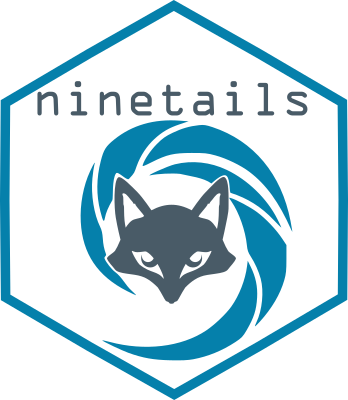

<!-- badges: start -->
<a href="https://github.com/LRB-IIMCB/ninetails/releases/"></a>
<a href="https://github.com/LRB-IIMCB/ninetails/blob/main/LICENSE"></a>

<a href="https://www.linux.org/" title="Go to Linux homepage"></a>
<a href="https://www.microsoft.com/" title="Go to Microsoft homepage"></a>
[](https://doi.org/10.5281/zenodo.13309819)

[](https://app.codecov.io/gh/LRB-IIMCB/ninetails)
<!-- badges: end -->


# ninetails 

**An R package for finding non-adenosine residues in poly(A) tails of Oxford Nanopore sequencing reads**

## Introduction

**Ninetails** detects and characterises non-adenosine nucleotides embedded within poly(A) tails of Oxford Nanopore sequencing reads. It currently supports three pipelines:

**WARNING! cDNA pipeline under construction! Please do not use it for now!**

| Pipeline | Basecaller | Input format | Function |
|---|---|---|---|
| Dorado DRS | Dorado ≥ 1.0.0 | POD5 + summary | `check_tails_dorado_DRS()` |
| Dorado cDNA | Dorado ≥ 1.0.0 | POD5 + BAM + summary | `check_tails_dorado_cDNA()` |
| Guppy (legacy) | Guppy ≤ 6.0.0 | fast5 + Nanopolish | `check_tails_guppy()` |

**Ninetails** can distinguish characteristic signal signatures of four nucleotide types: adenosines (A), cytosines (C), guanosines (G), and uridines (U).


> **Note**
>
> **For detailed documentation including explanation of additional data processing and visualisation features see the [Ninetails Wiki](https://github.com/LRB-IIMCB/ninetails/wiki)**

The software is still under active development. All suggestions for improvement are welcome. Please note that the code may change frequently, so use it with caution.

**Ninetails** has been tested on Linux Mint 20.3, Ubuntu 20.04.3 and Windows 11 with R 4.1.2, R 4.2.0 and R 4.2.1.


## Installation

**Ninetails** is not currently available on CRAN or Bioconductor. Install it using `devtools`:

```r
install.packages("devtools")
devtools::install_github('LRB-IIMCB/ninetails')
library(ninetails)
```

> **Note for Windows users**
>
> Before installing `devtools` on Windows, install `Rtools` so packages compile correctly: <https://cran.r-project.org/bin/windows/Rtools/>

Installation takes approximately 20 seconds on a typical PC. Additional time is required to install and configure third-party components (Dorado, POD5 Python module, Keras).

**Ninetails requires additional components to operate. See the [Wiki](https://github.com/LRB-IIMCB/ninetails/wiki) for full installation instructions.**


## General usage

All pipeline wrappers share the `check_tails` prefix. Choose the appropriate function for your data type.

---

### Dorado DRS pipeline — `check_tails_dorado_DRS()`

The recommended pipeline for direct RNA sequencing (DRS) data basecalled with Dorado ≥ 1.0.0 using POD5 format.

```r
results <- ninetails::check_tails_dorado_DRS(
  dorado_summary = "path/to/dorado_alignment_summary.txt",
  pod5_dir       = "path/to/pod5_dir/",
  num_cores      = 2,
  qc             = TRUE,
  save_dir       = "~/output/",
  prefix         = "experiment1",
  part_size      = 40000,
  cleanup        = FALSE
)
```

**Parameters:**

| parameter | description |
|---|---|
| `dorado_summary` | Path to Dorado summary file or in-memory data frame. Must contain `read_id`, `filename`, `poly_tail_length`, `poly_tail_start`, `poly_tail_end`. |
| `pod5_dir` | Path to directory containing POD5 files. |
| `num_cores` | Number of CPU cores for parallel processing. |
| `qc` | Logical. Apply quality control filtering (recommended). |
| `save_dir` | Output directory. Created if it does not exist. |
| `prefix` | Optional prefix for output file names. |
| `part_size` | Number of reads per processing chunk. Reduce if memory is limited. |
| `cleanup` | Logical. Remove intermediate files after completion. |

---

### Dorado cDNA pipeline — `check_tails_dorado_cDNA()`

For complementary DNA (cDNA) sequencing data. Extends the DRS pipeline with BAM file processing for sequence extraction and automatic read orientation classification (polyA vs polyT).

```r
results <- ninetails::check_tails_dorado_cDNA(
  bam_file       = "path/to/aligned_cdna.bam",
  dorado_summary = "path/to/dorado_summary.txt",
  pod5_dir       = "path/to/pod5_dir/",
  num_cores      = 2,
  qc             = TRUE,
  save_dir       = "~/output/",
  prefix         = "experiment1",
  part_size      = 40000,
  cleanup        = FALSE
)
```

**Additional parameter vs DRS:**

| parameter | description |
|---|---|
| `bam_file` | Path to BAM file containing aligned cDNA reads with basecalled sequences. Required for read orientation classification. |

The cDNA pipeline classifies each read as `polyA`, `polyT`, or `unidentified` using Dorado-style SSP/VNP primer matching before processing. Output tables include an additional `tail_type` column.

---

### Guppy legacy pipeline — `check_tails_guppy()`

For DRS data basecalled with Guppy ≤ 6.0.0 using fast5 format and Nanopolish poly(A) coordinates. **This pipeline is no longer actively developed** (critical bug fixes only).

> **Warning**
>
> **Current pre-release versions of the package work with Guppy basecaller 6.0.0 and lower. Please be aware to use a compatible version of basecaller.**

```r
results <- ninetails::check_tails_guppy(
  polya_data = system.file('extdata', 'test_data',
                            'nanopolish_output.tsv',
                            package = 'ninetails'),
  sequencing_summary = system.file('extdata', 'test_data',
                                    'sequencing_summary.txt',
                                    package = 'ninetails'),
  workspace = system.file('extdata', 'test_data',
                           'basecalled_fast5',
                           package = 'ninetails'),
  num_cores      = 2,
  basecall_group = 'Basecall_1D_000',
  pass_only      = TRUE,
  save_dir       = '~/output/')
```

Before running, ensure that the Nanopolish output file, sequencing summary, and fast5 directory all correspond to the same set of reads. Complete discrepancies will cause an error; partial mismatches will produce a warning and the affected reads will be omitted.

> **Note**
>
> Ninetails does not support single fast5 files. Convert them to multi-fast5 format with `ont-fast5-api` before using this pipeline.

**Legacy classification codes** (Guppy pipeline only — these differ from the Dorado pipelines):

| class | comments | explanation |
|---|---|---|
| `modified` | `YAY` | Move transition present, non-A residue detected |
| `unmodified` | `MAU` | Move transition absent, non-A residue undetected |
| `unmodified` | `MPU` | Move transition present, non-A residue undetected |
| `unclassified` | `QCF` | Nanopolish QC failed |
| `unclassified` | `NIN` | Not included in the analysis (`pass_only = TRUE`) |
| `unclassified` | `IRL` | Insufficient read length |

---

## Output

All pipelines return a named list with two data frames and save them as tab-delimited text files in `save_dir`. A log file is also written for each run.

### `read_classes`

Complete accounting of all reads in the analysis. Each read is assigned one class and one comment code.

| column | content |
|---|---|
| `readname` | Unique read identifier |
| `contig` | Reference sequence/transcript the read mapped to |
| `polya_length` | Estimated poly(A) tail length (nt) |
| `qc_tag` | Mapping quality score |
| `class` | Classification result: `decorated`, `blank`, or `unclassified` |
| `comments` | 3-letter code explaining the classification outcome (see below) |
| `tail_type` | `polyA` or `polyT` — cDNA pipeline only |

**Classification codes:**

| class | comments | explanation |
|---|---|---|
| `decorated` | `YAY` | Non-adenosine residue detected |
| `blank` | `MAU` | No signal deviation detected; pure poly(A) signal |
| `blank` | `MPU` | Signal deviation present but predicted as adenosine only |
| `unclassified` | `IRL` | Poly(A) tail too short (< 10 nt) for reliable analysis |
| `unclassified` | `UNM` | Read unmapped to reference |
| `unclassified` | `BAC` | Invalid poly(A) coordinates (`poly_tail_start = 0`) |

### `nonadenosine_residues`

Modification-level detail for `decorated` reads only. Each row is one predicted non-adenosine residue. A read may have multiple rows if multiple modifications were detected.

| column | content |
|---|---|
| `readname` | Unique read identifier |
| `contig` | Reference sequence/transcript |
| `prediction` | Predicted nucleotide type: `C`, `G`, or `U` |
| `est_nonA_pos` | Estimated position within the poly(A) tail from the 3' end (integer, Dorado pipelines) |
| `polya_length` | Total poly(A) tail length (nt) |
| `qc_tag` | Mapping quality score |
| `tail_type` | `polyA` or `polyT` — cDNA pipeline only |


## Important notes

- Signal transformations can place a heavy load on memory, especially for full sequencing runs. Adjust `part_size` to manage memory usage.
- Ninetails relies on external poly(A) boundary detection (Dorado / Nanopolish / tailfindr) and may underestimate terminal modifications at the last 1–2 nucleotides of the tail.
- Since version 1.0.2, Ninetails is compatible with tailfindr output via `tailfindr_compatibility()`.


## Citation

Please cite **Ninetails** as:

Gumińska, N., Matylla-Kulińska, K., Krawczyk, P.S. et al. Direct profiling of non-adenosines in poly(A) tails of endogenous and therapeutic mRNAs with Ninetails. *Nat Commun* **16**, 2664 (2025). https://doi.org/10.1038/s41467-025-57787-6


## Troubleshooting

If you encounter a bug, please open an issue on GitHub. To help diagnose the problem, provide a minimal reproducible example (5–10 reads with corresponding Dorado summary / Nanopolish output / sequencing summary), so the error can be reproduced and fixed.


## Maintainer

Any issues regarding **Ninetails** should be addressed to Natalia Gumińska (nguminska (at) iimcb.gov.pl).

**Ninetails** was developed in the <a href="https://www.iimcb.gov.pl/en/research/41-laboratory-of-rna-biology-era-chairs-group">Laboratory of RNA Biology</a> (Dziembowski Lab) at the <a href="https://www.iimcb.gov.pl/en/">International Institute of Molecular and Cell Biology</a> in Warsaw.
