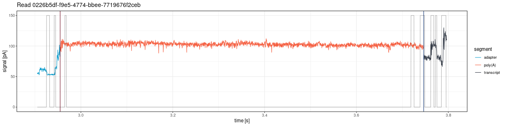
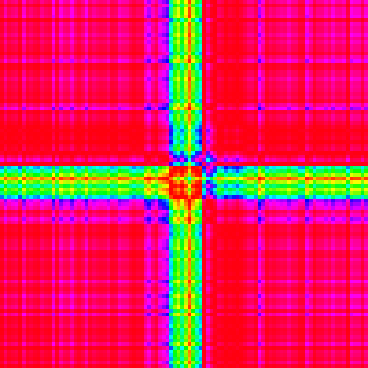
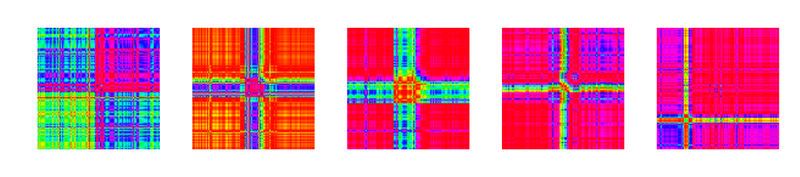

# Visual inspection of signals

> **Note:** Signal visualization functions are available for both the
> **Guppy legacy pipeline** (fast5-based:
> [`plot_squiggle_fast5()`](https://LRB-IIMCB.github.io/ninetails/reference/plot_squiggle_fast5.md),
> [`plot_tail_range_fast5()`](https://LRB-IIMCB.github.io/ninetails/reference/plot_tail_range_fast5.md))
> and the **Dorado DRS pipeline** (POD5-based:
> [`plot_squiggle_pod5()`](https://LRB-IIMCB.github.io/ninetails/reference/plot_squiggle_pod5.md),
> [`plot_tail_range_pod5()`](https://LRB-IIMCB.github.io/ninetails/reference/plot_tail_range_pod5.md)).

This vignette describes functions for visual inspection of raw nanopore
signals.

## Plotting whole reads

### plot_squiggle_fast5()

Draw the entire signal (squiggle) for a given read:

``` r
plot <- ninetails::plot_squiggle_fast5(
  readname = "0226b5df-f9e5-4774-bbee-7719676f2ceb",
  nanopolish = system.file('extdata', 'test_data',
                           'nanopolish_output.tsv',
                           package = 'ninetails'),
  sequencing_summary = system.file('extdata', 'test_data',
                                   'sequencing_summary.txt',
                                   package = 'ninetails'),
  workspace = system.file('extdata', 'test_data',
                          'basecalled_fast5',
                          package = 'ninetails'),
  basecall_group = 'Basecall_1D_000',
  moves = FALSE,
  rescale = TRUE
)
print(plot)
```

Parameters:

- `readname`: Read identifier
- `nanopolish`: Path to Nanopolish polya output
- `sequencing_summary`: Path to sequencing summary
- `workspace`: Path to directory with multi-fast5 files
- `basecall_group`: Fast5 hierarchy level (default: “Basecall_1D_000”)
- `moves`: If TRUE, show move transitions in background
- `rescale`: If TRUE, scale signal to picoamperes (pA)

The plot shows vertical lines marking poly(A) tail boundaries:

- **Navy blue**: 5’ end
- **Red**: 3’ end


------------------------------------------------------------------------

### plot_squiggle_pod5()

Draw the entire signal (squiggle) for a given read from POD5 files
(Dorado DRS pipeline):

``` r
plot <- ninetails::plot_squiggle_pod5(
  readname = "0e8e52dc-3a71-4c33-9a00-e1209ba4d2e9",
  dorado_summary = system.file('extdata', 'test_data', 'pod5_DRS',
                               'aligned_summary.txt',
                               package = 'ninetails'),
  workspace = system.file('extdata', 'test_data', 'pod5_DRS',
                          package = 'ninetails'),
  rescale = TRUE
)
print(plot)
```

Parameters:

- `readname`: Read identifier
- `dorado_summary`: Path to Dorado summary file, or a pre-loaded data
  frame containing at minimum `read_id`, `poly_tail_start`,
  `poly_tail_end`, and `filename` columns
- `workspace`: Path to directory containing POD5 files
- `rescale`: If TRUE, scale signal to picoamperes (pA)

> **Note:** The `moves` parameter is not available for POD5-based
> functions. Move data is not stored in POD5 files in a format
> accessible without the Dorado basecaller internals.

The plot shows vertical lines marking poly(A) tail boundaries:

- **Red**: 5’ end (poly(A) start)
- **Navy blue**: 3’ end (poly(A) end)


Full read signal from POD5, rescaled to pA

------------------------------------------------------------------------

## Plotting tail range

### plot_tail_range_fast5()

Plot only the poly(A) tail region:

``` r
plot <- ninetails::plot_tail_range_fast5(
  readname = "0226b5df-f9e5-4774-bbee-7719676f2ceb",
  nanopolish = system.file('extdata', 'test_data',
                           'nanopolish_output.tsv',
                           package = 'ninetails'),
  sequencing_summary = system.file('extdata', 'test_data',
                                   'sequencing_summary.txt',
                                   package = 'ninetails'),
  workspace = system.file('extdata', 'test_data',
                          'basecalled_fast5',
                          package = 'ninetails'),
  basecall_group = 'Basecall_1D_000',
  moves = TRUE,
  rescale = TRUE
)
print(plot)
```

Accepts the same parameters as
[`plot_squiggle_fast5()`](https://LRB-IIMCB.github.io/ninetails/reference/plot_squiggle_fast5.md).


Tail region plotted with moves=FALSE

## 

### plot_tail_range_pod5()

Plot only the poly(A) tail region from POD5 files (Dorado DRS pipeline):

``` r
plot <- ninetails::plot_tail_range_pod5(
  readname = "0e8e52dc-3a71-4c33-9a00-e1209ba4d2e9",
  dorado_summary = system.file('extdata', 'test_data', 'pod5_DRS',
                               'aligned_summary.txt',
                               package = 'ninetails'),
  workspace = system.file('extdata', 'test_data', 'pod5_DRS',
                          package = 'ninetails'),
  flank = 150,
  rescale = TRUE
)
print(plot)
```

Parameters:

- `readname`: Read identifier
- `dorado_summary`: Path to Dorado summary file, or a pre-loaded data
  frame (same as
  [`plot_squiggle_pod5()`](https://LRB-IIMCB.github.io/ninetails/reference/plot_squiggle_pod5.md))
- `workspace`: Path to directory containing POD5 files
- `flank`: Number of positions to include on each side of the poly(A)
  region (default: 150)
- `rescale`: If TRUE, scale signal to picoamperes (pA)


Poly(A) tail region from POD5, rescaled to pA

------------------------------------------------------------------------

## Plotting tail segments

### plot_tail_chunk()

Visualize a specific signal chunk from the segmentation step:

``` r
# First, create tail chunk list using pipeline functions
tfl <- ninetails::create_tail_feature_list(...)
tcl <- ninetails::create_tail_chunk_list(tail_feature_list = tfl, num_cores = 2)

# Then plot a specific chunk
plot <- ninetails::plot_tail_chunk(
  chunk_name = "5c2386e6-32e9-4e15-a5c7-2831f4750b2b_1",
  tail_chunk_list = tcl
)
print(plot)
```

> **Note:** This function shows raw signal only; no scaling to
> picoamperes.

## 

## Plotting Gramian Angular Fields

### plot_gaf()

Visualize a single GAF matrix used for CNN classification:

``` r
# First, create GAF list using pipeline functions
gl <- ninetails::create_gaf_list(tail_chunk_list = tcl, num_cores = 2)

# Plot a specific GAF
plot <- ninetails::plot_gaf(
  gaf_name = "5c2386e6-32e9-4e15-a5c7-2831f4750b2b_1",
  gaf_list = gl
)
print(plot)
```

The plot shows a 2-channel image:

- **Channel 1**: Gramian Angular Summation Field (GASF)
- **Channel 2**: Gramian Angular Difference Field (GADF)



Gramian angular field

### plot_multiple_gaf()

Plot all GAFs in a list (saves to working directory):

``` r
ninetails::plot_multiple_gaf(
  gaf_list = gl,
  num_cores = 10
)
```



Multiple Gramian angular fields

> **Warning:** Use with caution. GAF lists can be very large, and
> plotting all at once may overload the system.

------------------------------------------------------------------------

## Signal visualization options

| Option            | Description                                   | Applies to           |
|-------------------|-----------------------------------------------|----------------------|
| `rescale = FALSE` | Raw signal per position                       | Fast5, POD5          |
| `rescale = TRUE`  | Signal scaled to picoamperes (pA) per second  | Fast5, POD5          |
| `moves = FALSE`   | Signal only                                   | Fast5 only           |
| `moves = TRUE`    | Signal with move transitions in background    | Fast5 only           |
| `flank`           | Positions flanking tail region (default: 150) | POD5 tail range only |

------------------------------------------------------------------------

## Use cases

Signal visualization is useful for:

- **Quality control**: Inspect individual reads for signal quality
- **Debugging**: Understand why specific reads were classified
  incorrectly
- **Validation**: Verify that detected non-adenosines correspond to
  visible signal deviations
- **Publication figures**: Generate high-quality signal plots

------------------------------------------------------------------------

## Summary of signal inspection functions

| Function                                                                                              | Description              | Input             |
|-------------------------------------------------------------------------------------------------------|--------------------------|-------------------|
| [`plot_squiggle_fast5()`](https://LRB-IIMCB.github.io/ninetails/reference/plot_squiggle_fast5.md)     | Full read signal         | Fast5 files       |
| [`plot_squiggle_pod5()`](https://LRB-IIMCB.github.io/ninetails/reference/plot_squiggle_pod5.md)       | Full read signal         | POD5 files        |
| [`plot_tail_range_fast5()`](https://LRB-IIMCB.github.io/ninetails/reference/plot_tail_range_fast5.md) | Poly(A) tail signal only | Fast5 files       |
| [`plot_tail_range_pod5()`](https://LRB-IIMCB.github.io/ninetails/reference/plot_tail_range_pod5.md)   | Poly(A) tail signal only | POD5 files        |
| [`plot_tail_chunk()`](https://LRB-IIMCB.github.io/ninetails/reference/plot_tail_chunk.md)             | Signal segment           | Intermediate data |
| [`plot_gaf()`](https://LRB-IIMCB.github.io/ninetails/reference/plot_gaf.md)                           | Single GAF image         | Intermediate data |
| [`plot_multiple_gaf()`](https://LRB-IIMCB.github.io/ninetails/reference/plot_multiple_gaf.md)         | Multiple GAF images      | Intermediate data |
