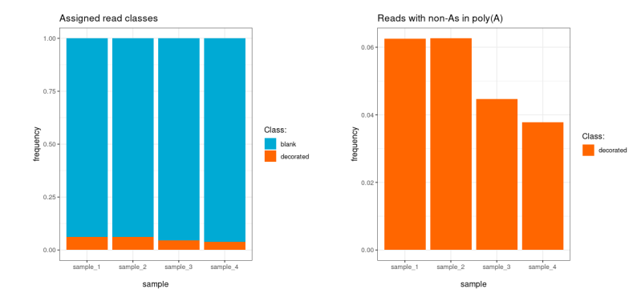
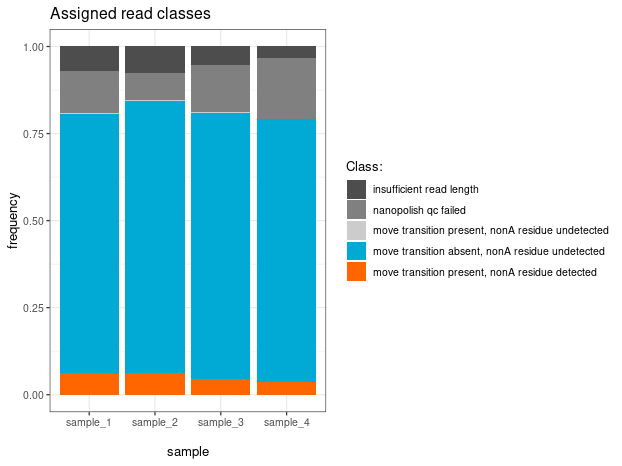
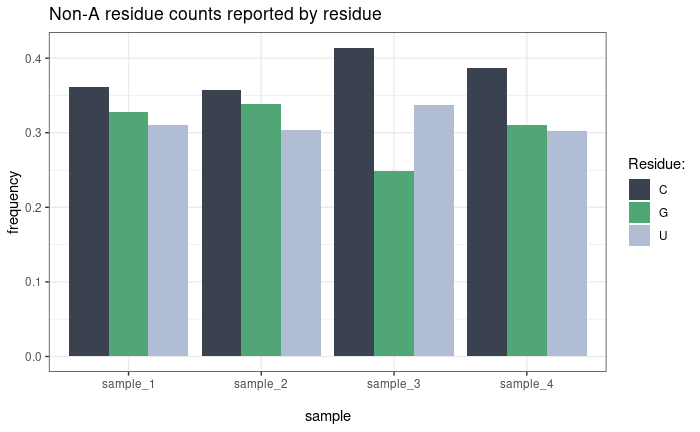
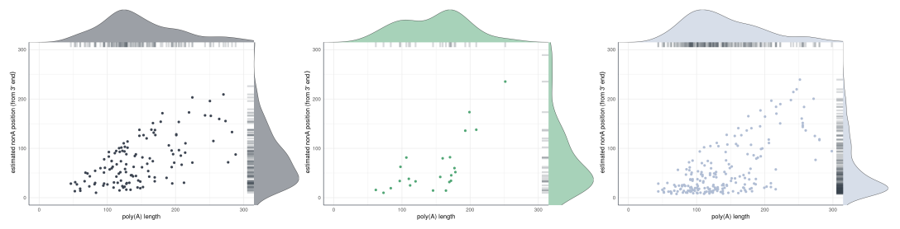
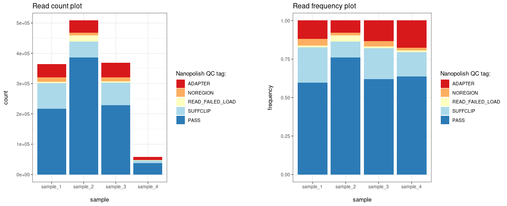

```{r, include = FALSE}
knitr::opts_chunk$set(
  collapse = TRUE,
  comment = "#>",
  eval = FALSE
)
```

This vignette documents all plotting functions provided by **ninetails**
for visualizing classification results, residue composition, poly(A)
tail distributions, and positional patterns. For interactive exploration
of these plots, see `vignette("shiny_app")`.

All plotting functions return `ggplot2` objects and can be further
customized with standard ggplot2 layers (themes, scales, labels).


## Read classification

`plot_class_counts()` produces bar charts of read classification results.
The `type` argument controls the level of detail.

```{r class-counts}
plt <- ninetails::plot_class_counts(
  class_data       = class_data,
  grouping_factor  = "sample_name",
  frequency        = TRUE,
  type             = "N"
)
print(plt)
```

### Parameters

| Parameter | Type | Default | Description |
|---|---|---|---|
| `class_data` | data.frame | *required* | Read classification table from ninetails |
| `grouping_factor` | character | `NA` | Column name to group by (e.g., `"sample_name"`, `"group"`) |
| `frequency` | logical | `FALSE` | If `TRUE`, show proportions instead of raw counts |
| `type` | character | `"N"` | Level of detail (see below) |

### Classification views

| Type | Description | Categories shown |
|---|---|---|
| `"N"` | Summary | decorated, blank, unclassified |
| `"R"` | Detailed | All comment codes (YAY, MAU, MPU, IRL, UNM, BAC) |
| `"A"` | Decorated only | Only decorated reads |



### Detailed classification

All reads — decorated, blank, and unclassified — are included and
colour-coded by their comment code.

```{r class-counts-detailed}
plt <- ninetails::plot_class_counts(
  class_data       = class_data,
  grouping_factor  = "sample_name",
  frequency        = TRUE,
  type             = "R"
)
print(plt)
```




---

## Residue counts

`plot_residue_counts()` shows the distribution of non-adenosine residue
types (C, G, U) across samples or conditions. Two counting modes are
available:

- **By residue** (default): Counts every individual non-A residue
  occurrence. A read with two C residues contributes 2 to the C count.
- **By read** (`by_read = TRUE`): Counts each read once per residue type.
  A read with two C residues contributes 1 to the C count.

```{r residue-counts}
plt <- ninetails::plot_residue_counts(
  residue_data     = residue_data,
  grouping_factor  = "sample_name",
  frequency        = TRUE,
  by_read          = FALSE
)
print(plt)
```

### Parameters

| Parameter | Type | Default | Description |
|---|---|---|---|
| `residue_data` | data.frame | *required* | Non-A residue table from ninetails |
| `grouping_factor` | character | `NA` | Grouping column |
| `frequency` | logical | `FALSE` | Show proportions instead of counts |
| `by_read` | logical | `FALSE` | Count by read instead of by individual residue |




---

## Non-A abundance

`plot_nonA_abundance()` shows the frequency of reads containing one, two,
or three or more separate non-adenosine residues per read. Frequencies
are computed relative to the total number of decorated reads in each
sample.

```{r abundance}
plt <- ninetails::plot_nonA_abundance(
  residue_data     = residue_data,
  grouping_factor  = "sample_name"
)
print(plt)
```

### Parameters

| Parameter | Type | Default | Description |
|---|---|---|---|
| `residue_data` | data.frame | *required* | Non-A residue table from ninetails |
| `grouping_factor` | character | `NA` | Grouping column |

The legend shows three categories: **single** (one non-A per read),
**two** (exactly two), and **more** (three or more).


---

## Poly(A) tail length distribution

`plot_tail_distribution()` plots density distributions of poly(A) tail
lengths across samples or conditions. Central tendency lines can be
overlaid.

```{r tail-dist}
plt <- ninetails::plot_tail_distribution(
  input_data       = class_data,
  grouping_factor  = "sample_name",
  max_length       = 200,
  value_to_show    = "median",
  ndensity         = TRUE
)
print(plt)
```

### Parameters

| Parameter | Type | Default | Description |
|---|---|---|---|
| `input_data` | data.frame | *required* | Data frame with `polya_length` column (class data or merged table) |
| `grouping_factor` | character | `NA` | Grouping column |
| `max_length` | numeric | `200` | Upper limit of the x-axis |
| `value_to_show` | character | `NA` | Central tendency line: `"mean"`, `"median"`, `"mode"`, or `NA` (none) |
| `ndensity` | logical | `TRUE` | If `TRUE`, normalize density so the peak equals 1 across groups |

Custom color palettes can be applied:

```{r tail-dist-palette}
# Apply a custom palette
plt + ggplot2::scale_color_manual(
  values = c("#D7191C", "#2C7BB6", "#FDAE61", "#ABD9E9")
)
```


---

## Non-A position distribution (rug density)

`plot_rug_density()` visualizes the positional distribution of
non-adenosine residues along poly(A) tails. Each point represents one
detected modification, plotted against its estimated position from the
3' end (x-axis) and the total tail length of the read (y-axis). Marginal
density curves on both axes show the overall distribution shape. Call the
function once per nucleotide type.

```{r rug-density}
plt_C <- ninetails::plot_rug_density(
  residue_data = residue_data,
  base         = "C",
  max_length   = 100
)
print(plt_C)
```

### Parameters

| Parameter | Type | Default | Description |
|---|---|---|---|
| `residue_data` | data.frame | *required* | Non-A residue table |
| `base` | character | *required* | Nucleotide type: `"C"`, `"G"`, or `"U"` |
| `max_length` | numeric | *required* | Maximum tail length for axis limits |

> **Note:** This function requires the `cowplot` package.
> Install with `install.packages("cowplot")`.

For large datasets, consider subsampling before plotting to keep the
scatter readable:

```{r rug-subsample}
# Subsample to 1000 points per base type
set.seed(42)
rd_sub <- residue_data[residue_data$prediction == "C", ]
if (nrow(rd_sub) > 1000) {
  keep <- sample.int(nrow(rd_sub), 1000, replace = FALSE)
  rd_sub <- rd_sub[keep, ]
}
plt <- ninetails::plot_rug_density(rd_sub, base = "C", max_length = 200)
```




---

## Panel characteristics

`plot_panel_characteristics()` produces a multi-panel summary of the full
tail composition for a dataset or subset (e.g., a single sample, group,
or transcript). The resulting plot can be aligned from either the 5' or
3' end of the tail.

```{r panel}
plt <- ninetails::plot_panel_characteristics(
  input_residue_data            = residue_data,
  input_class_data              = class_data,
  input_merged_nonA_tables_data = NULL,
  type                          = "default",
  max_length                    = 100,
  direction_5_prime             = TRUE
)
print(plt)
```

### Parameters

| Parameter | Type | Default | Description |
|---|---|---|---|
| `input_residue_data` | data.frame | *required* | Non-A residue table |
| `input_class_data` | data.frame | *required* | Read classification table |
| `input_merged_nonA_tables_data` | data.frame | `NULL` | Merged table (optional) |
| `type` | character | `"default"` | Panel layout type |
| `max_length` | numeric | `100` | Maximum tail length |
| `direction_5_prime` | logical | `TRUE` | Align from 5' end (`TRUE`) or 3' end (`FALSE`) |

The panel contains the following subplots:

- **A** — Read counts
- **B** — Frequency of non-adenosine residues
- **C** — Poly(A) tail length distribution
- **D** — Normalised distribution of non-adenosines (binned by length)
- **E** — Raw distribution of non-adenosines


---

## Nanopolish QC tags

> **Note:** This section applies only to the Guppy legacy pipeline
> (`check_tails_guppy()`).

The `nanopolish_qc()` and `plot_nanopolish_qc()` functions allow
visualization of QC tags assigned by the Nanopolish polya function.

```{r nanopolish-qc}
# Summarise QC tags per sample
qc_summary <- ninetails::nanopolish_qc(
  class_data,
  grouping_factor = "sample_name"
)

# Plot by read count
plt_count <- ninetails::plot_nanopolish_qc(qc_summary, frequency = FALSE)

# Plot by frequency
plt_freq <- ninetails::plot_nanopolish_qc(qc_summary, frequency = TRUE)

print(plt_count)
print(plt_freq)
```

### Parameters (nanopolish_qc)

| Parameter | Type | Default | Description |
|---|---|---|---|
| `class_data` | data.frame | *required* | Read classification table |
| `grouping_factor` | character | `NA` | Grouping column |

### Parameters (plot_nanopolish_qc)

| Parameter | Type | Default | Description |
|---|---|---|---|
| `processing_info` | data.frame | *required* | Output from `nanopolish_qc()` |
| `frequency` | logical | `FALSE` | Show proportions instead of counts |




---

## Interactive dashboard

For interactive exploration of all plots described above, ninetails
provides a Shiny dashboard. See `vignette("shiny_app")` for details.

```{r dashboard}
ninetails::launch_signal_browser(
  class_file   = "/path/to/read_classes.txt",
  residue_file = "/path/to/nonadenosine_residues.txt"
)
```


---

## Summary of plotting functions

| Function | Description | Required data |
|---|---|---|
| `plot_class_counts()` | Read classification bar chart | `class_data` |
| `plot_residue_counts()` | Residue type distribution (C/G/U) | `residue_data` |
| `plot_nonA_abundance()` | Reads with 1, 2, 3+ non-A residues | `residue_data` |
| `plot_tail_distribution()` | Poly(A) tail length density | `class_data` or merged table |
| `plot_rug_density()` | Non-A position scatterplot with density | `residue_data` |
| `plot_panel_characteristics()` | Multi-panel composition summary | `class_data` + `residue_data` |
| `plot_nanopolish_qc()` | Nanopolish QC tag distribution | `nanopolish_qc()` output |
| `plot_squiggle_fast5()` | Full read signal (fast5) | Fast5 files |
| `plot_squiggle_pod5()` | Full read signal (POD5) | POD5 files |
| `plot_tail_range_fast5()` | Poly(A) tail signal (fast5) | Fast5 files |
| `plot_tail_range_pod5()` | Poly(A) tail signal (POD5) | POD5 files |
| `plot_tail_chunk()` | Signal segment | Intermediate data |
| `plot_gaf()` / `plot_multiple_gaf()` | Gramian Angular Fields | Intermediate data |
