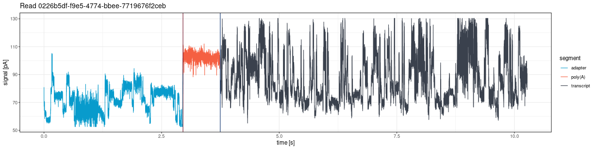
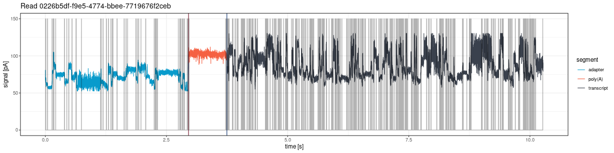
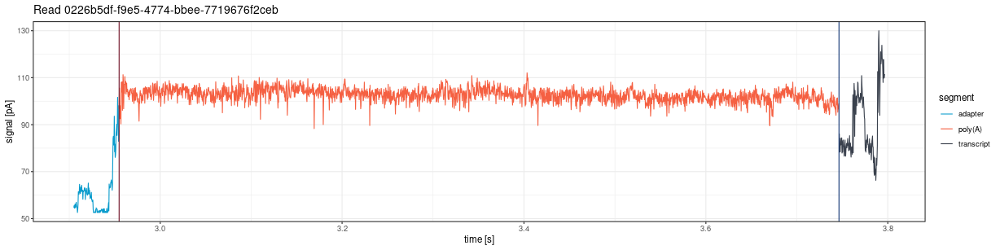
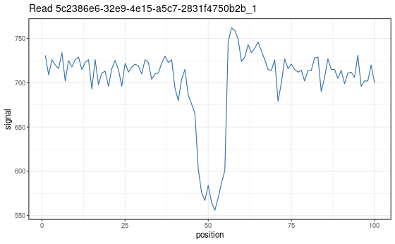

```{r, include = FALSE}
knitr::opts_chunk$set(
  collapse = TRUE,
  comment = "#>",
  eval = FALSE
)
```

> **Note:** The signal visualization functions described in this vignette work with **fast5 files from the Guppy legacy pipeline** (`check_tails_guppy()`) only.

This vignette describes functions for visual inspection of raw nanopore signals.

## Plotting whole reads

### plot_squiggle_fast5()

Draw the entire signal (squiggle) for a given read:

```{r squiggle}
plot <- ninetails::plot_squiggle_fast5(
  readname = "0226b5df-f9e5-4774-bbee-7719676f2ceb",
  nanopolish = system.file('extdata', 'test_data',
                           'nanopolish_output.tsv',
                           package = 'ninetails'),
  sequencing_summary = system.file('extdata', 'test_data',
                                   'sequencing_summary.txt',
                                   package = 'ninetails'),
  workspace = system.file('extdata', 'test_data',
                          'basecalled_fast5',
                          package = 'ninetails'),
  basecall_group = 'Basecall_1D_000',
  moves = FALSE,
  rescale = TRUE
)
print(plot)
```

Parameters:

- `readname`: Read identifier
- `nanopolish`: Path to Nanopolish polya output
- `sequencing_summary`: Path to sequencing summary
- `workspace`: Path to directory with multi-fast5 files
- `basecall_group`: Fast5 hierarchy level (default: "Basecall_1D_000")
- `moves`: If TRUE, show move transitions in background
- `rescale`: If TRUE, scale signal to picoamperes (pA)

The plot shows vertical lines marking poly(A) tail boundaries:

- **Navy blue**: 5' end
- **Red**: 3' end





---

## Plotting tail range

### plot_tail_range_fast5()

Plot only the poly(A) tail region:

```{r tail-range}
plot <- ninetails::plot_tail_range_fast5(
  readname = "0226b5df-f9e5-4774-bbee-7719676f2ceb",
  nanopolish = system.file('extdata', 'test_data',
                           'nanopolish_output.tsv',
                           package = 'ninetails'),
  sequencing_summary = system.file('extdata', 'test_data',
                                   'sequencing_summary.txt',
                                   package = 'ninetails'),
  workspace = system.file('extdata', 'test_data',
                          'basecalled_fast5',
                          package = 'ninetails'),
  basecall_group = 'Basecall_1D_000',
  moves = TRUE,
  rescale = TRUE
)
print(plot)
```

Accepts the same parameters as `plot_squiggle_fast5()`.




---

## Plotting tail segments

### plot_tail_chunk()

Visualize a specific signal chunk from the segmentation step:

```{r tail-chunk}
# First, create tail chunk list using pipeline functions
tfl <- ninetails::create_tail_feature_list(...)
tcl <- ninetails::create_tail_chunk_list(tail_feature_list = tfl, num_cores = 2)

# Then plot a specific chunk
plot <- ninetails::plot_tail_chunk(
  chunk_name = "5c2386e6-32e9-4e15-a5c7-2831f4750b2b_1",
  tail_chunk_list = tcl
)
print(plot)
```

> **Note:** This function shows raw signal only; no scaling to picoamperes.


---

## Plotting Gramian Angular Fields

### plot_gaf()

Visualize a single GAF matrix used for CNN classification:

```{r gaf-single}
# First, create GAF list using pipeline functions
gl <- ninetails::create_gaf_list(tail_chunk_list = tcl, num_cores = 2)

# Plot a specific GAF
plot <- ninetails::plot_gaf(
  gaf_name = "5c2386e6-32e9-4e15-a5c7-2831f4750b2b_1",
  gaf_list = gl
)
print(plot)
```

The plot shows a 2-channel image:

- **Channel 1**: Gramian Angular Summation Field (GASF)
- **Channel 2**: Gramian Angular Difference Field (GADF)


### plot_multiple_gaf()

Plot all GAFs in a list (saves to working directory):

```{r gaf-multiple}
ninetails::plot_multiple_gaf(
  gaf_list = gl,
  num_cores = 10
)
```


> **Warning:** Use with caution. GAF lists can be very large, and plotting all at once may overload the system.

---

## Signal visualization options

| Option | Description |
|---|---|
| `rescale = FALSE` | Raw signal per position |
| `rescale = TRUE` | Signal scaled to picoamperes (pA) per second |
| `moves = FALSE` | Signal only |
| `moves = TRUE` | Signal with move transitions in background |

---

## Use cases

Signal visualization is useful for:

- **Quality control**: Inspect individual reads for signal quality
- **Debugging**: Understand why specific reads were classified incorrectly
- **Validation**: Verify that detected non-adenosines correspond to visible signal deviations
- **Publication figures**: Generate high-quality signal plots

---

## Summary of signal inspection functions

| Function | Description | Input |
|---|---|---|
| `plot_squiggle_fast5()` | Full read signal | Fast5 files |
| `plot_tail_range_fast5()` | Poly(A) tail signal only | Fast5 files |
| `plot_tail_chunk()` | Signal segment | Intermediate data |
| `plot_gaf()` | Single GAF image | Intermediate data |
| `plot_multiple_gaf()` | Multiple GAF images | Intermediate data |
