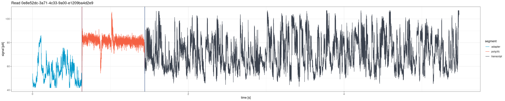
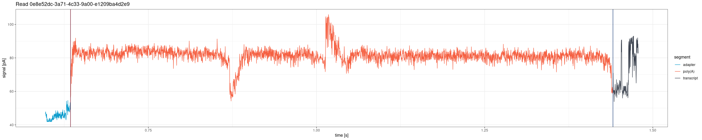

```{r, include = FALSE}
knitr::opts_chunk$set(
  collapse = TRUE,
  comment = "#>",
  eval = FALSE
)
```

> **Note:** Signal visualization functions are available for both the
> **Guppy legacy pipeline** (fast5-based: `plot_squiggle_fast5()`,
> `plot_tail_range_fast5()`) and the **Dorado DRS pipeline** (POD5-based:
> `plot_squiggle_pod5()`, `plot_tail_range_pod5()`).

This vignette describes functions for visual inspection of raw nanopore
signals. For interactive signal browsing with filters and read navigation,
see the Signal Viewer tab in the Shiny dashboard:
`vignette("shiny_app")`.


## Plotting whole reads

### plot_squiggle_fast5()

Draw the entire signal (squiggle) for a given read from fast5 files:

```{r squiggle}
plot <- ninetails::plot_squiggle_fast5(
  readname = "0226b5df-f9e5-4774-bbee-7719676f2ceb",
  nanopolish = system.file('extdata', 'test_data',
                           'nanopolish_output.tsv',
                           package = 'ninetails'),
  sequencing_summary = system.file('extdata', 'test_data',
                                   'sequencing_summary.txt',
                                   package = 'ninetails'),
  workspace = system.file('extdata', 'test_data',
                          'basecalled_fast5',
                          package = 'ninetails'),
  basecall_group = 'Basecall_1D_000',
  moves = FALSE,
  rescale = TRUE
)
print(plot)
```

#### Parameters

| Parameter | Type | Default | Description |
|---|---|---|---|
| `readname` | character | *required* | Unique read identifier |
| `nanopolish` | character/data.frame | *required* | Path to Nanopolish polya output or a pre-loaded data frame |
| `sequencing_summary` | character/data.frame | *required* | Path to sequencing summary or a pre-loaded data frame |
| `workspace` | character | *required* | Path to directory with multi-fast5 files |
| `basecall_group` | character | `"Basecall_1D_000"` | Fast5 hierarchy level for basecall data |
| `moves` | logical | `FALSE` | If `TRUE`, show move transitions as background shading |
| `rescale` | logical | `TRUE` | If `TRUE`, scale signal to picoamperes (pA) per second |

The plot shows vertical lines marking poly(A) tail boundaries:

- **Red**: 5' end (poly(A) start)
- **Navy blue**: 3' end (poly(A) end)


---

### plot_squiggle_pod5()

Draw the entire signal for a given read from POD5 files (Dorado DRS
pipeline):

```{r squiggle-pod5}
plot <- ninetails::plot_squiggle_pod5(
  readname = "0e8e52dc-3a71-4c33-9a00-e1209ba4d2e9",
  dorado_summary = system.file('extdata', 'test_data', 'pod5_DRS',
                               'aligned_summary.txt',
                               package = 'ninetails'),
  workspace = system.file('extdata', 'test_data', 'pod5_DRS',
                          package = 'ninetails'),
  rescale = TRUE
)
print(plot)
```

#### Parameters

| Parameter | Type | Default | Description |
|---|---|---|---|
| `readname` | character | *required* | Unique read identifier |
| `dorado_summary` | character/data.frame | *required* | Path to Dorado summary file or a pre-loaded data frame with `read_id`, `poly_tail_start`, `poly_tail_end`, and `filename` columns |
| `workspace` | character | *required* | Path to directory containing POD5 files |
| `rescale` | logical | `TRUE` | If `TRUE`, scale signal to picoamperes (pA) |
| `residue_data` | data.frame | `NULL` | Non-A residue table for overlay highlighting (optional) |
| `nonA_flank` | numeric | `250` | Number of raw signal positions flanking each non-A overlay rectangle |

> **Note:** The `moves` parameter is not available for POD5-based
> functions. Move data is not stored in POD5 files in a format
> accessible without the Dorado basecaller internals.



---

## Plotting tail range

### plot_tail_range_fast5()

Plot only the poly(A) tail region from fast5 files, with optional
flanking sequence:

```{r tail-range}
plot <- ninetails::plot_tail_range_fast5(
  readname = "0226b5df-f9e5-4774-bbee-7719676f2ceb",
  nanopolish = system.file('extdata', 'test_data',
                           'nanopolish_output.tsv',
                           package = 'ninetails'),
  sequencing_summary = system.file('extdata', 'test_data',
                                   'sequencing_summary.txt',
                                   package = 'ninetails'),
  workspace = system.file('extdata', 'test_data',
                          'basecalled_fast5',
                          package = 'ninetails'),
  basecall_group = 'Basecall_1D_000',
  moves = TRUE,
  rescale = TRUE
)
print(plot)
```

Accepts the same parameters as `plot_squiggle_fast5()`.


---

### plot_tail_range_pod5()

Plot only the poly(A) tail region from POD5 files, with configurable
flanking and optional non-A residue overlay:

```{r tail-range-pod5}
plot <- ninetails::plot_tail_range_pod5(
  readname = "0e8e52dc-3a71-4c33-9a00-e1209ba4d2e9",
  dorado_summary = system.file('extdata', 'test_data', 'pod5_DRS',
                               'aligned_summary.txt',
                               package = 'ninetails'),
  workspace = system.file('extdata', 'test_data', 'pod5_DRS',
                          package = 'ninetails'),
  flank = 150,
  rescale = TRUE
)
print(plot)
```

#### Parameters

| Parameter | Type | Default | Description |
|---|---|---|---|
| `readname` | character | *required* | Unique read identifier |
| `dorado_summary` | character/data.frame | *required* | Path to Dorado summary file or pre-loaded data frame |
| `workspace` | character | *required* | Path to directory containing POD5 files |
| `flank` | numeric | `150` | Number of raw signal positions to include on each side of the poly(A) region |
| `rescale` | logical | `TRUE` | If `TRUE`, scale signal to picoamperes (pA) |
| `residue_data` | data.frame | `NULL` | Non-A residue table for overlay highlighting (optional) |
| `nonA_flank` | numeric | `250` | Width (in raw positions) of each non-A overlay rectangle |




### Non-A residue overlay

When `residue_data` is provided, both `plot_squiggle_pod5()` and
`plot_tail_range_pod5()` overlay semi-transparent rectangles at the
estimated positions of detected non-adenosine residues. Each rectangle
is colored by residue type:

| Residue | Color | Hex |
|---|---|---|
| C (cytidine) | Dark gray | `#3a424f` |
| G (guanosine) | Green | `#50a675` |
| U (uridine) | Light blue-gray | `#b0bdd4` |

The `nonA_flank` parameter controls the width of each rectangle in raw
signal positions (default: 250 positions on each side of the estimated
center). A letter label (C, G, or U) is placed at the top of each
rectangle.

```{r tail-range-overlay}
# Plot with non-A overlay
plot <- ninetails::plot_tail_range_pod5(
  readname       = "0e8e52dc-3a71-4c33-9a00-e1209ba4d2e9",
  dorado_summary = dorado_summary_df,
  workspace      = "/path/to/pod5/",
  flank          = 150,
  rescale        = FALSE,
  residue_data   = residue_data,
  nonA_flank     = 250
)
print(plot)
```

Position conversion: the function converts `est_nonA_pos` (nucleotide
position from the 3' end) to raw signal coordinates using linear
interpolation between `poly_tail_start` and `poly_tail_end`.


---

## Plotting tail segments

### plot_tail_chunk()

Visualize a specific signal chunk from the segmentation step. This
function is mainly useful for debugging the pipeline or understanding
how individual segments are classified.

```{r tail-chunk}
# First, create tail chunk list using pipeline functions
tfl <- ninetails::create_tail_feature_list(...)
tcl <- ninetails::create_tail_chunk_list(tail_feature_list = tfl, num_cores = 2)

# Then plot a specific chunk
plot <- ninetails::plot_tail_chunk(
  chunk_name = "5c2386e6-32e9-4e15-a5c7-2831f4750b2b_1",
  tail_chunk_list = tcl
)
print(plot)
```

#### Parameters

| Parameter | Type | Description |
|---|---|---|
| `chunk_name` | character | Identifier of the chunk (format: `readname_chunkindex`) |
| `tail_chunk_list` | list | Output from `create_tail_chunk_list()` |

> **Note:** This function shows raw signal only; no scaling to
> picoamperes is applied.


---

## Plotting Gramian Angular Fields

### plot_gaf()

Visualize a single GAF matrix used for CNN classification. Each GAF
image has two channels representing the Gramian Angular Summation Field
(GASF) and the Gramian Angular Difference Field (GADF).

```{r gaf-single}
# First, create GAF list using pipeline functions
gl <- ninetails::create_gaf_list(tail_chunk_list = tcl, num_cores = 2)

# Plot a specific GAF
plot <- ninetails::plot_gaf(
  gaf_name = "5c2386e6-32e9-4e15-a5c7-2831f4750b2b_1",
  gaf_list = gl
)
print(plot)
```

#### Parameters

| Parameter | Type | Description |
|---|---|---|
| `gaf_name` | character | Identifier of the GAF (same format as chunk names) |
| `gaf_list` | list | Output from `create_gaf_list()` |


### plot_multiple_gaf()

Plot all GAFs in a list. Each plot is saved as an image file in the
working directory.

```{r gaf-multiple}
ninetails::plot_multiple_gaf(
  gaf_list  = gl,
  num_cores = 10
)
```

#### Parameters

| Parameter | Type | Default | Description |
|---|---|---|---|
| `gaf_list` | list | *required* | Output from `create_gaf_list()` |
| `num_cores` | integer | `1` | Number of cores for parallel rendering |

> **Warning:** Use with caution. GAF lists can be very large, and
> plotting all at once may overload the system.


---

## Signal visualization options

| Option | Description | Applies to |
|---|---|---|
| `rescale = FALSE` | Raw signal per position | Fast5, POD5 |
| `rescale = TRUE` | Signal scaled to picoamperes (pA) per second | Fast5, POD5 |
| `moves = FALSE` | Signal only | Fast5 only |
| `moves = TRUE` | Signal with move transitions in background | Fast5 only |
| `flank` | Positions flanking tail region (default: 150) | POD5 tail range only |
| `residue_data` | Non-A residue overlay highlighting | POD5 only |
| `nonA_flank` | Width of overlay rectangles (default: 250) | POD5 only |


---

## Use cases

Signal visualization is useful for:

- **Quality control**: Inspect individual reads for signal quality and
  verify that poly(A) boundaries are correctly identified
- **Debugging**: Understand why specific reads were classified
  incorrectly by examining the raw signal shape
- **Validation**: Verify that detected non-adenosines correspond to
  visible signal deviations within the poly(A) region
- **Publication figures**: Generate high-quality signal plots for
  manuscripts and presentations
- **Non-A overlay inspection**: Confirm that the residue position
  estimates align with actual signal perturbations


---

## Interactive signal viewer

For browsing signals interactively with filters, read navigation, and
non-A overlay, use the Shiny dashboard's Signal Viewer tab:

```{r dashboard-signal}
ninetails::launch_signal_browser(
  summary_file = "/path/to/dorado_summary.txt",
  pod5_dir     = "/path/to/pod5/",
  residue_file = "/path/to/nonadenosine_residues.txt"
)
```

The dashboard provides:

- Filterable read list (by poly(A) length, decoration status, residue
  type, alignment genome, mapping quality)
- Previous/Next navigation through filtered reads
- **Static Viewer** sub-tab with full signal and zoomed poly(A) region
- **Dynamic Explorer** sub-tab with interactive Plotly zoom and pan
- Automatic non-A residue overlay when residue data is available

See `vignette("shiny_app")` for complete documentation.


---

## Summary of signal inspection functions

| Function | Description | Input |
|---|---|---|
| `plot_squiggle_fast5()` | Full read signal | Fast5 files |
| `plot_squiggle_pod5()` | Full read signal (+ optional non-A overlay) | POD5 files |
| `plot_tail_range_fast5()` | Poly(A) tail signal only | Fast5 files |
| `plot_tail_range_pod5()` | Poly(A) tail signal (+ optional non-A overlay) | POD5 files |
| `plot_tail_chunk()` | Signal segment from segmentation | Intermediate data |
| `plot_gaf()` | Single GAF image (GASF + GADF) | Intermediate data |
| `plot_multiple_gaf()` | Batch GAF rendering | Intermediate data |
